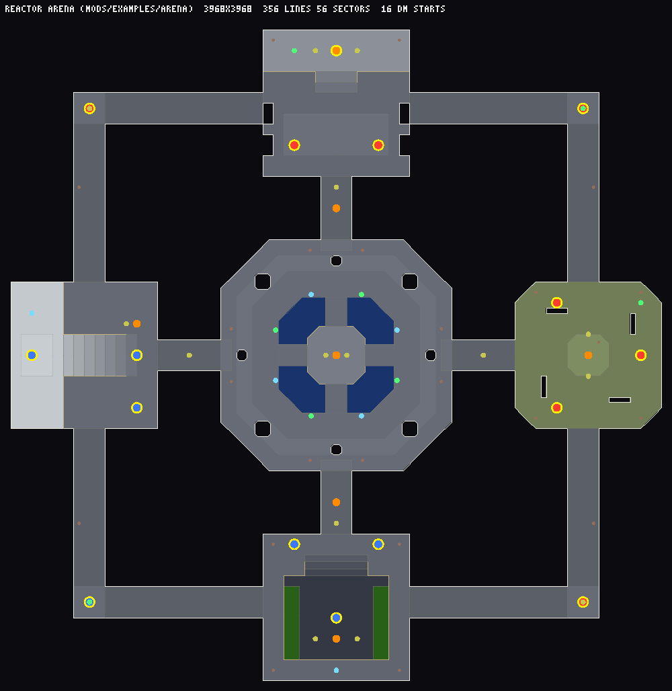

# Making a Doom Town mod

A **mod** is one file: a Doom WAD holding **one map**, the **art** it needs, and a small
JSON lump called **`MODINFO`** that says which game mode it plays and with what rules.
Merge it into this repository and it shows up in every player's *Host a room* picker;
anyone can open a room with it and 63 bots (or 199, in war) fill the empty slots until
humans arrive.

You can build the map two ways:

- with **our map DSL**, a few hundred lines of TypeScript that paint rooms, yards,
  stairs and water onto a grid (this is how the war maps and the battle-royale town were
  made), or
- with a **classic Doom editor** — Ultimate Doom Builder, SLADE, Eureka, DoomBuilder X —
  saving in plain Doom format.

Then `npm run mods` packs it, `npm run mod:check` tells you everything that is wrong
with it in plain words, and a pull request ships it.

This guide is also on the site at **`/modding.html`** (the menu's *Make a mod* link).

## Contents

1. [Quick start: your first mod in five minutes](#quick-start-your-first-mod-in-five-minutes)
2. [What is in a mod file](#what-is-in-a-mod-file)
3. [MODINFO reference](#modinfo-reference)
4. [Thing types](#thing-types)
5. [Textures, flats and licences](#textures-flats-and-licences)
6. [Building a map with the DSL](#building-a-map-with-the-dsl)
7. [Building a map with a Doom editor](#building-a-map-with-a-doom-editor)
8. [Testing it](#testing-it)
9. [Checking it: `npm run mod:check`](#checking-it-npm-run-modcheck)
10. [Submitting it](#submitting-it)
11. [Hosting a room with it](#hosting-a-room-with-it)
12. [Example 1: a deathmatch arena](#example-1-a-deathmatch-arena)
13. [Example 2: a war map](#example-2-a-war-map)
14. [Example 3: a rules remix](#example-3-a-rules-remix)
15. [Limits and FAQ](#limits-and-faq)

## Quick start: your first mod in five minutes

You need Node.js 22 or newer and git.

```bash
git clone https://github.com/m0dE/doom-town && cd doom-town
npm install
npm run fetch                       # downloads Freedoom (FreeDM + Freedoom 2: the textures you can use)

cp -r mods/examples/arena mods/mymap
```

Edit `mods/mymap/MODINFO.json` — give it your own id, map name, title and author:

```json
{
  "format": 1,
  "id": "mymap",
  "title": "My First Map",
  "author": "your name",
  "license": "CC0-1.0",
  "description": "One line the host picker shows.",
  "mode": "deathmatch",
  "map": "MYMAP",
  "slots": 16
}
```

Open `mods/mymap/map.mts`, set `NAME = 'MYMAP'`, and change something you will notice —
the hall's floor flat, a light level, where the rocket launcher sits. Then:

```bash
npm run mods                               # builds every mod → public/mods/<id>.wad + index.json
npm run mod:check public/mods/mymap.wad    # validates it and plays 60 s with bots
npm run dev                                # http://localhost:5190
```

Open **http://localhost:5190/?offline=1&mod=mods/mymap.wad** and play your map against
bots. That is the whole loop: edit, `npm run mods`, reload.

## What is in a mod file

A mod is a PWAD with, in this order (`npm run mods` writes exactly this):

| lump(s) | what |
|---|---|
| `MODINFO` | UTF-8 JSON, [the reference below](#modinfo-reference) |
| map marker (e.g. `ARENA`) | named as `MODINFO.map` says, 1–8 characters A–Z 0–9 _ |
| `THINGS` `LINEDEFS` `SIDEDEFS` `VERTEXES` `SEGS` `SSECTORS` `NODES` `SECTORS` | the map, **Doom format**, nodes built by any node builder |
| `REJECT` `BLOCKMAP` | optional: the game builds its own blockmap when it is missing, and treats a missing REJECT as "everything can see everything" |
| `PNAMES` `TEXTURE1` | definitions of the wall textures the map uses |
| `P_START` … `P_END` | the patches those textures need that the game's base pak lacks |
| `F_START` … `F_END` | the flats the map needs that the base pak lacks |

Rules of the file:

- **Exactly one map.** No Hexen-format maps (`BEHAVIOR`), no UDMF (`TEXTMAP`), no
  ZDoom extended nodes (`XNOD`/`ZNOD`).
- **At most 4 MB.** Players download it when they join your room. Art the base pak
  already has costs nothing; the example arena is 80 KB, the 16384 × 16384 battle-royale
  town 2.2 MB.
- **No overriding the game.** Lumps like `PLAYPAL`, `COLORMAP`, sounds (`DS*`), menus,
  the status bar or sprites the game already has are refused: a mod adds a map, it does
  not reskin the game for everyone.
- Anything else (DEHACKED, scripts, music, new sprites) is ignored or refused — see
  [Limits](#limits-and-faq).

The sim reads only the map lumps; the client merges the art over the base pak by lump
name, exactly like Doom loads a PWAD.

## MODINFO reference

```json
{
  "format": 1,
  "id": "br01",
  "title": "Doom Town Royale",
  "author": "Doom Town",
  "license": "BSD-3-Clause",
  "description": "64 marines, one island, one survivor.",
  "mode": "battle-royale",
  "map": "BR01",
  "slots": 64,
  "ghosts": false,
  "bosses": false,
  "rules": { "matchSeconds": 900, "lobbySeconds": 45, "zone": [ ... ], "loot": { ... } }
}
```

### Fields

| field | required | value |
|---|---|---|
| `format` | yes | `1` |
| `id` | yes | 2–16 characters, `a-z` and `0-9` only (no dashes: room names use dashes between words). Unique among installed mods. The packed file is `public/mods/<id>.wad`. |
| `title` | yes | up to 40 characters, shown in the server list and the host picker |
| `author` | yes | up to 40 characters |
| `license` | yes | an SPDX id from the [allowed list](#licences) |
| `description` | recommended | one line, up to 200 characters |
| `mode` | yes | `deathmatch`, `team-deathmatch`, `elimination`, `war` or `battle-royale` |
| `map` | yes | the map's marker name, upper case, 1–8 characters (`ARENA`, `HILL3`, `BR01`) |
| `slots` | no | players in a room, 2–200; every empty slot is a bot. Default: the mode's (64; 24 in elimination; 200 in war). Teams are `slot % 2`, so use an even number in team modes. |
| `ghosts` | no | `true`: players pass through each other (good for crowded maps). Default: `true` in war, `false` elsewhere |
| `bosses` | no | `true`: a Cyberdemon or Spider Mastermind shows up every so often and drops a BFG. Deathmatch and team deathmatch only. Default `false` |
| `rules` | no | the mode's rules; every key is optional (the mode's default applies) |

### Rules

Times are in seconds; the game converts them to tics (35 per second).

| rule | modes | default | range | what |
|---|---|---|---|---|
| `matchSeconds` | all | 600 (DM, TDM), 1200 (war), 900 (battle royale) | 30–3600 | match length; then a 10 s scoreboard and the next match |
| `roundSeconds` | elimination | 150 | 20–900 | one round's time limit |
| `freezeSeconds` | elimination | 5 | 0–30 | frozen time at the start of a round |
| `roundsToWin` | elimination | 7 | 1–50 | rounds that win the match |
| `tickets` | war | 3000 | 50–100000 | each team's tickets: −1 per death, −1 every 5 s while holding fewer points than the enemy |
| `friendlyFire` | TDM, elimination, war | `false` | `true`/`false` | teammates can hurt each other |
| `lobbySeconds` | battle royale | 45 | 5–300 | the lobby before the dropship leaves |
| `dropAltitude` | battle royale | 4096 | 512–16384 | the dropship's height above the highest floor, map units |
| `startBullets` | battle royale | 20 | 0–200 | bullets in the starting kit (fist, pistol) |
| `vehicles` | battle royale | `true` | `true`/`false` | the map's buggies (thing 9040) spawn |
| `supplyDrops` | battle royale | `true` | `true`/`false` | supply crates land at storm stages 2, 3 and 4 |
| `zone` | battle royale | 5 stages, below | 1–8 stages | the storm |
| `loot` | battle royale | below | weights 0–100 | what crates spill |

**`zone`** is a list of stages. Each stage waits, then shrinks the safe circle to its
`radius`:

| field | range | what |
|---|---|---|
| `wait` | 0–600 | seconds before this stage starts shrinking |
| `shrink` | 1–600 | seconds the shrinking takes |
| `radius` | 0–100 | the circle after this stage, in % of the first circle (which covers the whole map). Never larger than the stage before. |
| `dps` | 0–100 | damage per second to anyone outside, armor ignored |

The default storm (BR01):

```json
"zone": [
  { "wait": 60, "shrink": 60, "radius": 60, "dps": 1 },
  { "wait": 45, "shrink": 45, "radius": 35, "dps": 2 },
  { "wait": 40, "shrink": 40, "radius": 18, "dps": 4 },
  { "wait": 30, "shrink": 30, "radius": 8,  "dps": 7 },
  { "wait": 30, "shrink": 30, "radius": 0,  "dps": 10 }
]
```

**`loot`** sets the weight (in percent, steps of 0.5) of rows of the crate loot table.
A crate spills 4–7 rows; the **first** is always drawn from the six health/armor rows,
so do not set all six to 0. Rows you leave out keep their default.

| row | spills | default |
|---|---|---|
| `healthBonus` | 3 health bonuses | 15 |
| `armorBonus` | 3 armor bonuses | 15 |
| `stimpack` | stimpack | 10 |
| `medikit` | medikit | 6 |
| `greenArmor` | green armor | 5 |
| `blueArmor` | blue armor | 1 |
| `shotgun` | shotgun + shells | 8 |
| `superShotgun` | super shotgun | 5 |
| `chaingun` | chaingun | 7 |
| `rocketLauncher` | rocket launcher | 4 |
| `plasma` | plasma gun | 3 |
| `bfg` | BFG 9000 | 0.5 |
| `bullets` | box of bullets | 6 |
| `shells` | box of shells | 5 |
| `rockets` | box of rockets | 3 |
| `cells` | cell charge | 2 |
| `backpack` | backpack | 3 |
| `berserk` | berserk | 2 |
| `soulsphere` | soulsphere | 0.5 |
| `sniper` | sniper rifle | 5 |
| `grenades` | grenade pack | 8 |

How rules reach the game: every client turns `rules` into the same list of numbers and
hands them to the simulation when the room's world is created (DESIGN.md "Mods: one
file per mod", keys 1–104), so every player runs the same game in lockstep. Unknown keys
are an error in `mod:check` (a typo would otherwise silently do nothing).

## Thing types

Things are placed by their **doomednum** (the "type" number every editor shows).

### Starts and Doom Town's own things

| type | thing | notes |
|---|---|---|
| 11 | deathmatch start | where players spawn in DM / TDM / elimination; in battle royale the storm and the dropship use them too. Place 8+ (the game adds extra spawn spots on open floor) |
| 1–4 | player 1–4 starts | used as spawn spots too |
| **9000** | red team start | war; also team spawns in TDM/elimination if present |
| **9001** | blue team start | |
| **9010** | capture point | war; the **angle** field is the radius / 8 (angle 32 = radius 256). Up to 8, lettered A, B, C… in the order they appear in THINGS |
| **9020** | loot crate | opened by *use* or any damage; spills `loot`. Any mode |
| **9030** | lobby spot | battle royale: where players wait before the dropship. Put them on an island sealed off from the playfield |
| **9040** | buggy | battle royale: a drivable vehicle |
| **9050** | sniper rifle | pickup (+10 bullets) |
| **9051** | grenade pack | pickup (+2 grenades, thrown with `G`) |
| 14 | teleport destination | for teleporter lines |

### Items

| | types |
|---|---|
| weapons | 2005 chainsaw, 2001 shotgun, 82 super shotgun, 2002 chaingun, 2003 rocket launcher, 2004 plasma gun, 2006 BFG 9000 |
| ammo | 2007 clip, 2048 box of bullets, 2008 shells, 2049 box of shells, 2010 rocket, 2046 box of rockets, 2047 cell, 17 cell pack, 8 backpack |
| health | 2014 health bonus, 2011 stimpack, 2012 medikit, 2013 soulsphere, 83 megasphere |
| armor | 2015 armor bonus, 2018 green armor, 2019 blue armor |
| powerups | 2023 berserk, 2024 invisibility, 2022 invulnerability, 2025 radiation suit, 2026 computer map, 2045 light amp visor |

In deathmatch modes weapons stay (a weapon on the map is never used up) and everything
else respawns after 30 s; in battle royale nothing respawns and weapons are taken.

### Decorations

Doom 2's decorations all work, but only those whose sprites the base pak already
carries are drawn (`mod:check` warns about the others). Today that is: 85 tall tech
lamp, 86 short tech lamp, 2028 floor lamp, 48 tech column, 30 tall green pillar,
44/45/46 tall blue/green/red torches, 55/56/57 short blue/green/red torches, 34
candle, 35 candelabra, 70 burning barrel, 2035 explosive barrel, 43 burnt tree, 54 big
tree, 47 stalagmite, 41 evil eye, 42 floating skull, 10/12/15 dead marines and gibs.

### Ignored

Monsters (no monsters in Doom Town, except the random bosses) and keys (every locked
door opens for anyone) are not spawned. `mod:check` warns if you place them.

### What each mode needs

| mode | needs |
|---|---|
| deathmatch, team deathmatch, elimination | 4+ deathmatch starts (8+ recommended) |
| war | red (9000) and blue (9001) team starts, 1–8 capture points (9010) |
| battle royale | deathmatch starts spread over the map (64 is ideal), crates (9020), lobby spots (9030) on a sealed-off island; buggies optional |

## Textures, flats and licences

### Freedoom art

Use **Freedoom's** textures and flats — the ones in FreeDM and in Freedoom Phase 2,
which `npm run fetch` downloads (from the official Freedoom 0.13.0 release, checked by
sha256) to `assets/freedm.wad` and `assets/freedoom2.wad`. Load `freedoom2.wad` in your
editor as the IWAD/resource (it has every Freedoom texture; FreeDM's are a subset). The
pack tool resolves names against FreeDM first, then Freedoom 2, and tells you to run
`npm run fetch` if either file is missing.
Never id Software's DOOM or DOOM2 WADs: their art is not free to redistribute.

`npm run mods` looks at every texture and flat your map uses and copies only what the
game's base pak (`public/freedm-lite.wad`) does not already have into your mod. Art in
the base pak is free in bytes; these are always there:

- **walls:** ASHWALL4 BIGDOOR2 BIGDOOR6 BRICK10 BRICK6 BRONZE1 BRONZE2 BROWN1 BROWN96
  BROWNGRN BROWNHUG COMPBLUE COMPSPAN COMPSTA1 COMPSTA2 COMPTALL COMPUTE1 COMPWERD
  DOORSTOP DOORTRAK EGSUPRT3 EXITSIGN GRAY1 GRAY5 GRAY7 LITE3 LITE5 LITEBLU4 LITERED1
  LITEYEL1 METAL METAL1 METAL2 METAL5 MODWALL1 PIPEWAL2 PLANET1 PLAT1 SHAWN2 SILVER1
  SLADWALL SLIME2 SLIME5 SPACEW4 STARBR2 STARG1 STARGR1 STARTAN1 STEP2 STEP4 STEP5 STEP6
  STEPLAD1 STEPTOP STONE STONE2 STUCCO1 SUPPORT2 SUPPORT3 SW1COMP SW2COMP TEKGREN2
  TEKGREN3 TEKLITE TEKWALL1 TEKWALL2 TEKWALL4 TEKWALL6 WFALL1-4 ZIMMER2 ZZWOLF10 A-BROWN1
- **flats:** CEIL3_5 CEIL5_1 CEIL5_2 CONS1_1 DEM1_6 FLAT1 FLAT14 FLAT19 FLAT20 FLAT23
  FLAT5_5 FLOOR0_1 FLOOR0_2 FLOOR0_3 FLOOR4_8 FLOOR5_2 FLOOR5_4 FLOOR7_1 FLOOR7_2
  FWATER1-4 MFLR8_1 NUKAGE1-3 RROCK03 RROCK17 SLIME13 SLIME16 STEP2 TLITE6_1 TLITE6_4
  TLITE6_6 F_SKY1

Everything else in FreeDM and Freedoom 2 works too; it just adds to your file's size. The sky of a mod
map is `SKY1`.

### Your own art

You may ship your own textures and flats if you made them (or they are under an allowed
licence). Put PNGs in your mod folder and `npm run mods` converts and packs them:

```
mods/mymap/
  textures/MYBRICK.png     a patch; 1..4096 wide, 1..254 high. Transparent pixels
                           (alpha < 128) are holes: use them for grates and fences
                           (masked mid textures).
  textures/MYGRATE.png
  flats/MYFLOOR.png        a floor/ceiling flat: exactly 64 x 64, no transparency
  textures.json            optional: wall textures composed of patches
```

- **Names** are the file names, upper-cased: 1–8 characters of `A-Z 0-9 _ -`
  (`mybrick.png` → `MYBRICK`).
- **Colours** are mapped to the nearest colour of Doom's palette (`PLAYPAL`), so
  paint with that palette in mind: saturated or very dark gradients band. Any PNG
  works (8-bit RGB/RGBA/grey or indexed, not interlaced).
- Every PNG in `textures/` is also a **wall texture of the same name and size** by
  itself, unless `textures.json` defines that name. `textures.json` composes textures
  from your patches and any Freedoom patch, Doom-style (later patches draw over earlier
  ones):

  ```json
  {
    "MYWALL": { "width": 128, "height": 128, "patches": [
      { "patch": "MYBRICK", "x": 0, "y": 0 },
      { "patch": "MYBRICK", "x": 64, "y": 0 },
      { "patch": "MYGRATE", "x": 32, "y": 32 } ] }
  }
  ```

- Use the names in your map like any other texture or flat (`'MYWALL'`,
  `'MYFLOOR'`); a map script's texture check knows them.
- A patch must not take a **Freedoom patch's name** (packing stops with an error: it
  would change Freedoom's own textures). A texture or flat of yours may reuse a
  Freedoom texture/flat name to replace it in your map.
- For loose files: `node tools/mods/pack.mjs --modinfo MODINFO.json --map map.wad
  --art mods/mymap` packs the same way.

`mod:check` verifies that every texture the map uses resolves to patches in the base pak
or your file. Credit the art in your README.

### Licences

`MODINFO.license` must be one of these (SPDX ids):

| licence | id |
|---|---|
| Creative Commons Zero (public domain) | `CC0-1.0` |
| Creative Commons Attribution | `CC-BY-4.0`, `CC-BY-3.0` |
| BSD (Freedoom's own licence) | `BSD-3-Clause`, `BSD-2-Clause` |
| MIT | `MIT` |
| GNU GPL 2 | `GPL-2.0-only`, `GPL-2.0-or-later` |

Not accepted: GPL-3.0 (cannot be combined with id's GPL-2.0-only engine code),
share-alike (`CC-BY-SA`), non-commercial (`CC-BY-NC`) and no-derivatives (`CC-BY-ND`)
licences. A map made only from Freedoom art plus your own geometry can use any of the
allowed licences; if you used other people's work, their licence must allow it and they
must be credited in your README.

## Building a map with the DSL

The map DSL lives in `tools/maps/lib/`. You paint **shapes** (rectangles, chamfered
rectangles, octagons, polygons with 0°/45°/90° edges, all on an 8-unit grid) with
**styles** (floor and ceiling heights, flats, light, wall textures); later paints go
over earlier ones. The compiler turns the painting into sectors and linedefs, our node
builder adds BSP nodes, and checks run on the result: structure, BSP against brute
force, and walkability (every start, item and point reachable both ways under the
bots' movement rules).

A map script exports `build()`, returning the canvas:

```ts
import { PaintCanvas, rect, oct, type Style } from '../../../tools/maps/lib/canvas.mts';
import { T, stairs } from '../../../tools/maps/lib/kit.mts';
import { out, room, solid } from '../../../tools/maps/lib/styles.mts';

export const NAME = 'MYMAP';
export const TITLE = 'My Map';

export function build(): PaintCanvas {
  // bounds, grid, and what unpainted space is: solid rock with this wall texture
  const c = new PaintCanvas(-1024, -1024, 1024, 1024, 8, solid('STONE2'));
  // an indoor room: floor 0, ceiling 192, floor/ceiling flats, light 160
  c.paint(rect(-768, -512, 768, 512), room(0, 192, 'FLOOR4_8', 'CEIL5_1', 160, { wall: 'TEKWALL4' }));
  // an open-air courtyard in the middle (sky ceiling)
  c.paint(oct(0, 0, 256), out(0, 'FLOOR7_1'));
  // stairs rising north to a ledge at 64
  stairs(c, -128, 256, 128, 384, 'N', [16, 32, 48], (z) => room(z, 192, 'STEP2', 'CEIL5_1', 160));
  c.paint(rect(-768, 384, 768, 512), room(64, 192, 'FLOOR4_8', 'CEIL5_1', 176));
  // things: x, y, type, angle
  for (const [x, y] of [[-640, -384], [640, -384], [-640, 0], [640, 0]]) c.thing(x, y, 11, 90);
  c.thing(0, 448, T.ROCKETL);
  c.thing(0, 0, T.MEDI);
  return c;
}
```

The building blocks:

| | what |
|---|---|
| `rect(x0, y0, x1, y1)`, `chamfer(x0, y0, x1, y1, k)`, `oct(cx, cy, r, ry?)`, `diamond(cx, cy, r)`, `poly([[x, y], ...])` | shapes (`canvas.mts`); vertices on the 8-unit grid, edges at 0°, 45° or 90° |
| `c.paint(shape, style)` | paints a style; a `solid(wall)` style makes the area solid |
| `c.modify(shape, f)` | restyles what is already painted inside the shape: `lighten(16)`, `raise(24)`, `withProps({ floorPic: 'FLAT10' })` (`kit.mts`) |
| `room(floor, ceil, floorPic, ceilPic, light, extra?)` | an indoor sector style (`styles.mts`) |
| `out(floor, floorPic, extra?)` | outdoors: sky ceiling at the common sky height (448) |
| `mass(top, wallTexture, extra?)` | a block standing in the open: crates, walls, rocks, building masses |
| `stairs(c, x0, y0, x1, y1, dir, levels, mk)` | a flight of steps rising toward `dir` (`kit.mts`) |
| `blob(cx, cy, rx, ry, rng)` | an irregular rocky outcrop shape |
| `T.SHOTGUN`, `T.MEDI`, `T.POINT`, … | thing type constants (`kit.mts`) |
| style extras | `wall` (one-sided wall texture), `riser` (texture of a step up onto this sector), `upper` (texture under a lower ceiling), `fence` (a two-sided blocking mid texture: railings, grates), `special`, `tag` |

Rules of thumb that keep bots (and players) happy:

- steps up at most **24** units, openings at least **56** high and **33** wide; drops
  are one-way;
- keep every area connected — the walkability check lists what cannot be reached;
- one sky height everywhere (`out()` does it): two different sky ceilings next to each
  other draw a sky "wall";
- lighting variety and landmarks make a map readable: a bright core, dim corridors, a
  different flat or wall in each area.

`npm run mods` compiles `map.mts` with these checks and stops with a list of problems
if any fail. To look at the result from above while you work:

```bash
npm run mods -- mods/mymap        # build just this one
```

and open the WAD in the game, or render a top-down PNG like `docs/maps/ARENA-top.png`
with `tools/maps/lib/topdown.mts` (see `tools/maps/build.mts --top`).

## Building a map with a Doom editor

Any editor that saves **Doom-format** maps works.

**Ultimate Doom Builder** (Windows; runs on Linux under Wine or Mono builds):

1. *File → New Map*. Game configuration: **Doom 2 (Doom format)**. Level name: your map
   name (e.g. `MYMAP`).
2. Resources: add **`assets/freedoom2.wad`** (after `npm run fetch`) so you see
   Freedoom's textures. Don't add id's DOOM2.WAD.
3. Node builder (*Map → Map Options* / *Preferences → Nodebuilder*): **ZDBSP - Normal
   (no reject)** or any builder that writes vanilla nodes. Not "compressed" or "UDMF"
   nodes.
4. Build. Doom Town's own things (9000, 9001, 9010, 9020, 9030, 9040, 9050, 9051) are
   not in the Doom 2 thing list: add a thing of any type and type the number into its
   *Type* field; it shows as an unknown thing, which is fine. A capture point's radius
   is its angle × 8.
5. Save as `mods/mymap/map.wad`.

**SLADE** works the same way (its map editor uses the same game configurations): pick
the Doom 2 (Doom format) configuration, add `freedoom2.wad` as the base resource, build
nodes with ZDBSP on save.

**Eureka** saves vanilla Doom maps and builds nodes itself.

Then put next to `map.wad` a `MODINFO.json` (its `map` field may differ from the name
inside the WAD; the packer renames it) and a `README.md`, and run `npm run mods`. The
packer takes the map from your WAD, adds the art from Freedoom and writes
`public/mods/<id>.wad`.

To pack loose files without a `mods/<id>/` directory:

```bash
node tools/mods/pack.mjs --modinfo MODINFO.json --map mymap.wad --out mymap-mod.wad
```

Special lines work as in Doom: doors, lifts, crushers, teleporters (with a teleport
destination thing), switches, light changes. Exits do nothing. Keys are never spawned,
so locked doors open for anyone. Animated textures and flats animate, and damaging
floors (sector specials 5, 7, 16) hurt.

## Testing it

**In the dev server:**

```bash
npm run dev
```

- **http://localhost:5190/?offline=1&mod=mods/mymap.wad** — plays the file against
  bots, offline (any URL or path the page can fetch works).
- Once `npm run mods` has listed your mod in `public/mods/index.json`, it is also
  installed in your local build: open the host picker in the menu, or a room named
  `test-mod-mymap` (add `?offline=1&room=test-mod-mymap` to play it alone).

**Without the repo:** on the live site, the menu's footer has **Test a mod file…**: it
takes a mod WAD from your disk and plays it offline against bots. Nobody else can join
that game, since nobody else has your file — that is what submitting is for.

Things to try: walk every route, jump down every ledge and back, watch where bots go
(a bot standing still at a wall usually means a step over 24 units or a gap under 56),
play a whole match to see the scoreboard and the next match start.

## Checking it: `npm run mod:check`

```bash
npm run mod:check public/mods/mymap.wad
npm run mod:check -- --all                        # every public/mods/*.wad
npm run mod:check -- public/mods/mymap.wad --seconds=120 --verbose
```

It checks, in order, and explains each problem in plain words:

1. **the file:** a PWAD, at most 4 MB, no lumps that would override the game;
2. **MODINFO:** valid JSON, every field and rule (types, ranges, which mode a rule
   belongs to, typos with a "did you mean"), the licence;
3. **the id:** its format, and that no other installed mod uses it; a map name shared
   with another mod must be the very same map;
4. **the map:** exactly one, named as MODINFO says, Doom format, vanilla nodes,
   references in range;
5. **things:** every type known, and what the mode needs (starts, team starts,
   capture points, crates, lobby spots); decorations without sprites;
6. **art:** every wall texture and flat resolves against the base pak plus the mod's
   own art;
7. **the game itself:** loads the map into the real simulation (`public/doomsim.wasm`)
   and plays 60 s with a full room of bots: no crash, the cost per tic, kills,
   captures or crates opened, whether bots move around, and that a snapshot taken
   halfway replays identically (lockstep needs that).

A passing run looks like this:

```text
=== public/mods/arena.wad

File ok
  + arena.wad: 80 KB (limit 4 MB)
MODINFO ok
  + arena: "Reactor Arena" by Doom Town examples, deathmatch, map ARENA, 16 slots, licence CC0-1.0
Map ok
  + ARENA: 356 linedefs, 528 sidedefs, 369 vertexes, 56 sectors, 231 subsectors, 230 nodes; 3968 x 3968 units
Textures and flats ok
  + 14 wall textures and 21 flats, all resolvable
Things ok
  + 75 things: 16 deathmatch starts, 36 items
Simulation (60 s with bots) ok
  + 2100 tics, 16 bots: 0.21 ms/tic average
  + 72 kills, 2902 events
  + 16 of 16 bots that spawned travelled more than 512 units
  + deterministic: a snapshot taken at 30 s stepped identically to the end

PASS  public/mods/arena.wad
```

and a failing one tells you what to do:

```text
MODINFO FAIL
  x "id" "Arena-2" must be 2-16 characters of a-z and 0-9 only (no dashes: room names use dashes between words)
  x licence "CC-BY-SA-4.0" is not accepted: share-alike terms are not compatible with the GPL-2.0 game
  x "mode" must be one of deathmatch, team-deathmatch, elimination, war, battle-royale (did you mean "deathmatch"?)
  x unknown rule "matchSecs" (did you mean "matchSeconds"?)
```

Warnings (`!`) don't fail the check, but read them.

## Submitting it

Mods enter the game through a **pull request** to
[github.com/m0dE/doom-town](https://github.com/m0dE/doom-town). Add:

- `mods/<id>/` — the source: `MODINFO.json`, `README.md`, and `map.mts` (DSL) or
  `map.wad` (editor; you may add your editor's project files too),
- `public/mods/<id>.wad` — the built file,
- `public/mods/index.json` — as `npm run mods` updated it.

Checklist (copy it into the pull request description):

```markdown
- [ ] `mods/<id>/` has MODINFO.json, README.md and the map source
- [ ] README credits everyone whose work is in it and states the licence
- [ ] all art is Freedoom's or mine/allowed, nothing from id's DOOM/DOOM2 WADs
- [ ] `npm run mods` built `public/mods/<id>.wad` and updated `public/mods/index.json`
- [ ] `npm run mod:check public/mods/<id>.wad` passes (paste the summary below)
- [ ] I played a full match on it with `?offline=1&mod=mods/<id>.wad`
- [ ] a screenshot or top-down picture is attached
```

Title it `mod: <id> — <title>`. Reviewers check that it plays well with bots, that the
file is not bigger than it needs to be, and the licence. Once merged and deployed, the
mod appears in everyone's host picker.

To update your mod later, change the source, rebuild, re-check, and open another pull
request; keep the same `id` (and the same `map` name unless you want rooms on the old
version to keep their map).

## Hosting a room with it

Every installed mod can be played in any room:

- **The host picker:** in the menu, *Host / Create room* lists the game modes and the
  installed mods; pick yours, name the room, and it is created. The server list shows a
  mod room with its title, a **MOD** badge and the author.
- **By room name:** a room whose name contains the word `mod` followed by the mod's id
  plays that mod: `na-mod-arena-1`, `fridays-mod-hill3`, `eu-mod-snipers-2`. The mod's
  mode and slot count apply; the other words are yours. Share the link
  (`…/?room=fridays-mod-hill3`) and friends land straight in it.

Everyone who joins downloads the mod's file, so a small file means a fast join.

## Example 1: a deathmatch arena

**`mods/examples/arena`** — *Reactor Arena*, 16-player deathmatch, built with the DSL,
80 KB.



`MODINFO.json`:

```json
{
  "format": 1, "id": "arena", "title": "Reactor Arena", "author": "Doom Town examples",
  "license": "CC0-1.0",
  "description": "A tight 16-player deathmatch around a flooded reactor core.",
  "mode": "deathmatch", "map": "ARENA", "slots": 16,
  "rules": { "matchSeconds": 300 }
}
```

A small map wants fewer players than the default 64, and shorter matches.

`map.mts` walks through the map from the middle out:

1. **The reactor hall** — `oct(0, 0, 704)`, an octagonal room; `c.modify` over a ring
   swaps its ceiling for a light flat and brightens it; the **moat** is a water-floored
   octagon 24 units down (the deepest you can still climb out of), the **core** an
   octagon 16 up holding the rocket launcher. Four `rect` **bridges** cross the moat,
   eight `chamfer` **pillars** give cover.
2. **Corridors** — four 192-wide `rect`s to the rooms, with a lower, lit doorframe
   where each meets the hall.
3. **Four rooms**, each with its own walls, flats and light so you always know where
   you are: a control room (`COMPSTA1` walls, a mezzanine reached by `stairs`, the
   plasma gun), an open **yard** under the sky (`F_SKY1` ceiling, broken walls, the
   super shotgun), a **pump room** with stairs down into a basin (chaingun, green
   armor), and a **tower** whose wide stair rises straight ahead of the corridor to a
   balcony (blue armor).
4. **The outer ring** — four L-shaped halls joining neighbouring rooms, so no room is
   a dead end.
5. **Things** — 16 deathmatch starts (three per room, one per ring corner), weapons
   with their ammo next to them, health and armor on opposite sides, decorations whose
   sprites the base pak carries.

Nearly every texture and flat is one the base pak has, which is why the file is tiny.

## Example 2: a war map

**`mods/examples/hill3`** — *Three Hills*, 16 v 16 war with three capture points,
373 KB.


```json
{
  "format": 1, "id": "hill3", "title": "Three Hills", "author": "Doom Town examples",
  "license": "CC0-1.0",
  "description": "16 v 16 war in a small valley: two watchtowers and the hill between them.",
  "mode": "war", "map": "HILL3", "slots": 32, "ghosts": true,
  "rules": { "matchSeconds": 900, "tickets": 800 }
}
```

32 slots instead of war's usual 200, so fewer tickets (800 instead of 3000).

What makes a war map:

- **Team starts:** 16 red (`T.RED_START`, 9000) in the west hangar, 16 blue
  (`T.BLUE_START`, 9001) in the east one.
- **Capture points:** three `T.POINT` (9010) things. Their order in THINGS gives the
  letters, so the script adds them last, in order: A at red's watchtower, B on the
  hill, C at blue's tower. The angle field is the radius / 8: `c.thing(0, 0, T.POINT,
  288 / 8)` is a 288-unit circle.
- **Fairness:** a `both(f)` helper calls `f(1)` and `f(-1)`; every coordinate inside is
  multiplied by `s`, so each base, tower, pond, rock and item is painted once for red
  and once rotated by 180° for blue.

Around that: a grassy valley with a rocky rim of random-height blocks (seeded `rng`,
so the build is reproducible), dirt roads from each base to the points, a terraced hill
(three `oct`s, 24 units apart) ringed by standing stones, towers with `stairs` up to a
battlemented lookout, ponds with ammo islands, and outcrops (`blob`) for cover. The
walkability check confirms both bases reach every point and item and back.

## Example 3: a rules remix

**`mods/examples/snipers`** — *Snipers Only Royale*: BR01's map, new rules. No map
work at all.

`map.mts` is one line — it points the packer at BR01's map script:

```ts
export { build, report, NAME, TITLE } from '../../br01/map.mts';
```

(With an editor-made map you would copy its `map.wad` instead.) Everything else is in
`MODINFO.json`:

```json
{
  "format": 1, "id": "snipers", "title": "Snipers Only Royale",
  "author": "Doom Town examples", "license": "BSD-3-Clause",
  "description": "Doom Town with crates full of sniper rifles and a storm that closes in under four minutes.",
  "mode": "battle-royale", "map": "BR01", "slots": 64,
  "rules": {
    "matchSeconds": 420, "lobbySeconds": 30, "startBullets": 40,
    "vehicles": true, "supplyDrops": true,
    "zone": [
      { "wait": 30, "shrink": 30, "radius": 50, "dps": 2 },
      { "wait": 25, "shrink": 25, "radius": 25, "dps": 4 },
      { "wait": 20, "shrink": 20, "radius": 10, "dps": 8 },
      { "wait": 15, "shrink": 20, "radius": 0,  "dps": 15 }
    ],
    "loot": {
      "healthBonus": 15, "armorBonus": 15, "stimpack": 10, "medikit": 6, "greenArmor": 5, "blueArmor": 1,
      "shotgun": 0, "superShotgun": 0, "chaingun": 0, "rocketLauncher": 0, "plasma": 0, "bfg": 0,
      "bullets": 20, "shells": 0, "rockets": 0, "cells": 0, "backpack": 4, "berserk": 2, "soulsphere": 0.5,
      "sniper": 30, "grenades": 8
    }
  }
}
```

- the storm has four stages and closes after 3:05 instead of five stages and 6:50;
- crates never spill shotguns, chainguns, launchers, plasma or BFGs; sniper rifles and
  boxes of bullets (the rifle uses 5 a shot) are common; the health/armor rows keep
  their weights so every crate still heals;
- 40 starting bullets, a 30 s lobby.

Because the map lumps are byte-for-byte BR01's, `mod:check` says "reuses mod br01's
map BR01 unchanged". (Using an existing map *name* for *different* geometry is an
error.)

## Limits and FAQ

**What can't a mod do?** Add monsters, new weapons, new sprites or sounds, scripts
(ACS, ZScript, DECORATE), DEHACKED patches, or music. The simulation is a port of
vanilla Doom's playsim shared by every player in lockstep; a mod chooses a map and the
numbers in `rules`, nothing more. Map features beyond vanilla Doom format (slopes,
3D floors, UDMF) are not supported.

**How big can a map be?** Doom coordinates are 16-bit: up to about 32000 units from
the origin. War maps are around 20000 × 12000, BR01 is 16384 × 16384. Bigger maps with
more bots cost more CPU per tic: `mod:check` warns above 6 ms/tic.

**How many players?** Up to 200 slots. Each empty slot is a bot running in every
player's browser, so a small map with 16 slots is cheaper and more fun than a small map
with 64.

**Can I use my own DOOM2.WAD's textures?** No. Players may load their own DOOM2.WAD
for the look, but a mod must work with Freedoom alone, and id's art cannot be
redistributed.

**Do I need to know TypeScript?** No — use an editor and the `map.wad` route. The DSL
is there for people who like their maps as code (and for maps too big to draw by hand).

**My map packs, but bots stand still.** Look for steps over 24 units, doorways under
56 high or narrower than 33, and areas only reachable by jumping. The DSL build's
walkability check names unreachable items and starts.

**Where is all this defined?** DESIGN.md, "Mods: one file per mod", is the contract;
`tools/mods/pack.mjs` builds mods, `tools/mods/check.mjs` checks them,
`src/mods/modinfo.ts` turns MODINFO into the numbers the simulation gets.
