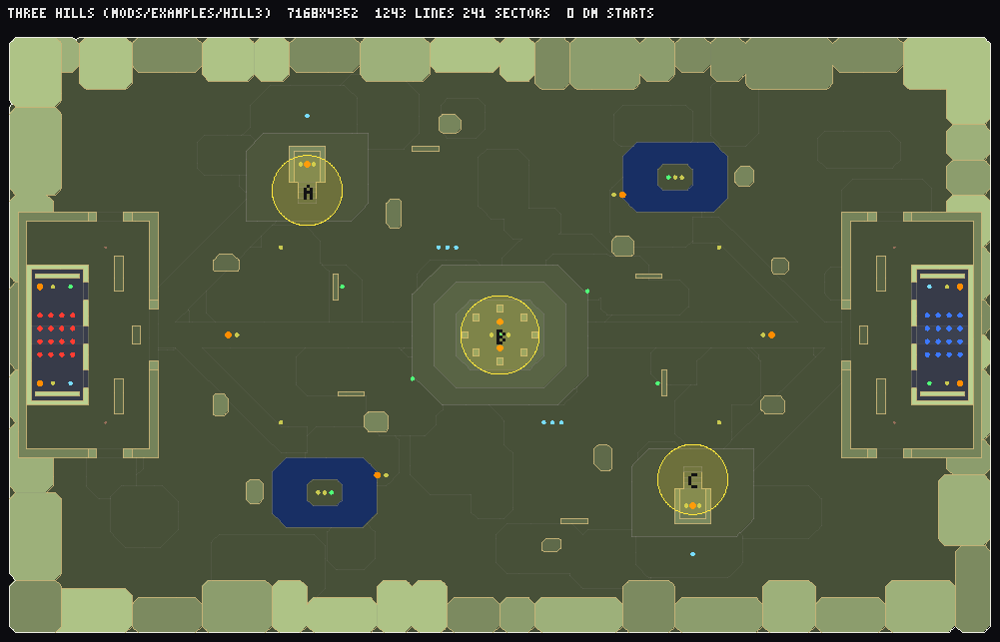

# hill3 — Three Hills

A compact 16 v 16 war map with three capture points: the second example of the
modding guide ([docs/MODDING.md](../../../docs/MODDING.md), "Example 2: a war map").



- **Mode:** war, 32 slots (16 a side), players pass through each other
  (`"ghosts": true`), 800 tickets a side, 15-minute matches.
- **Layout:** a grassy valley inside a rocky rim. Red's compound is in the west, blue's
  in the east; each has a hangar with 16 team starts (thing 9000 red, 9001 blue), a
  shotgun, a chaingun and supplies. Three capture points (thing 9010, angle = radius
  / 8): **A** a watchtower on a knoll on red's side (rocket launcher on the lookout),
  **B** a terraced hill in the middle ringed by standing stones (megasphere and two
  plasma guns on top), **C** blue's watchtower. Two ponds with ammo islands, rock
  outcrops and ruined walls give cover along the lanes.
- **Fairness:** the map is point-symmetric around the centre — every feature painted
  for red is painted again for blue rotated by 180° (the `both()` helper in
  `map.mts`).

## Files

| file | what |
|---|---|
| `MODINFO.json` | id, title, mode `war`, map `HILL3`, slots, tickets |
| `map.mts` | the map, written with the map DSL (`tools/maps/lib/`) |
| `README.md` | this file: credits and licence |

```bash
npm run mods
npm run mod:check public/mods/hill3.wad
```

## Credits and licence

Map script by the Doom Town project, released under **CC0-1.0**. Textures and flats
are Freedoom's (BSD-3-Clause,
[assets/COPYING-FREEDOOM.txt](../../../assets/COPYING-FREEDOOM.txt)).
